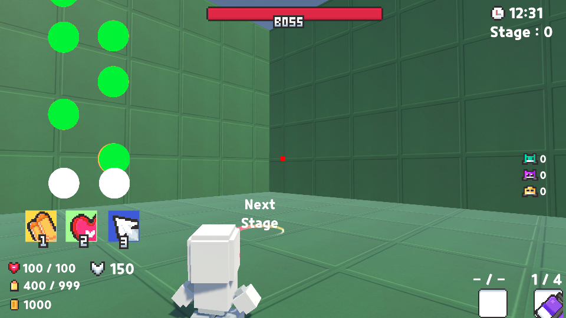
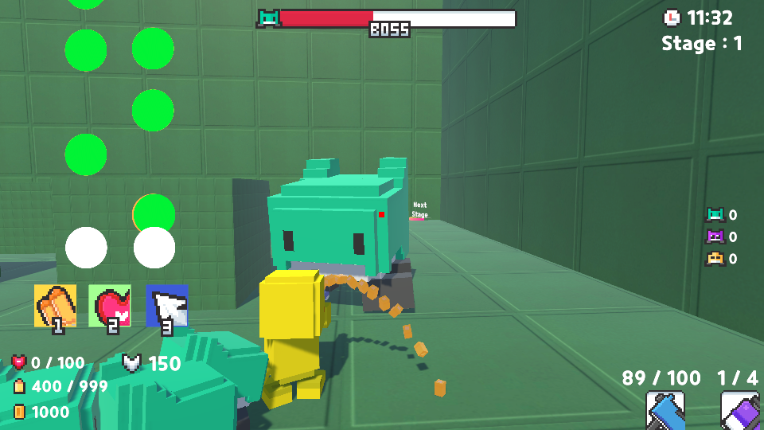
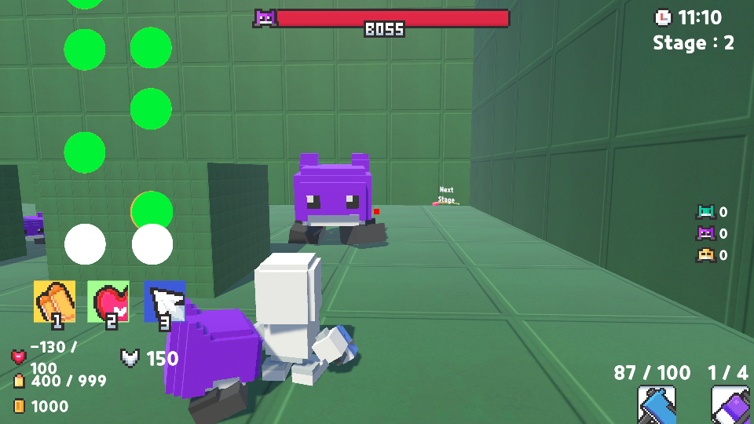
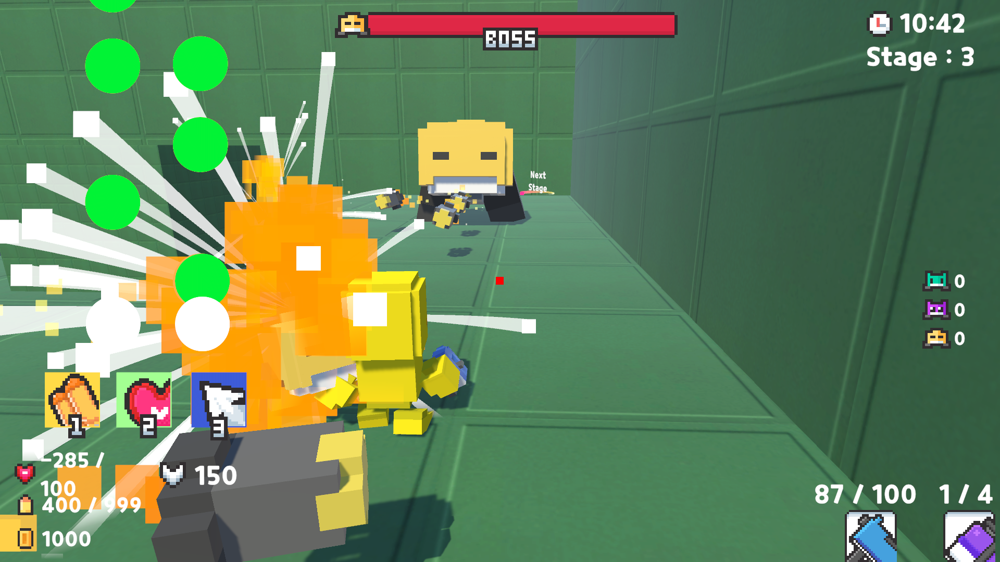
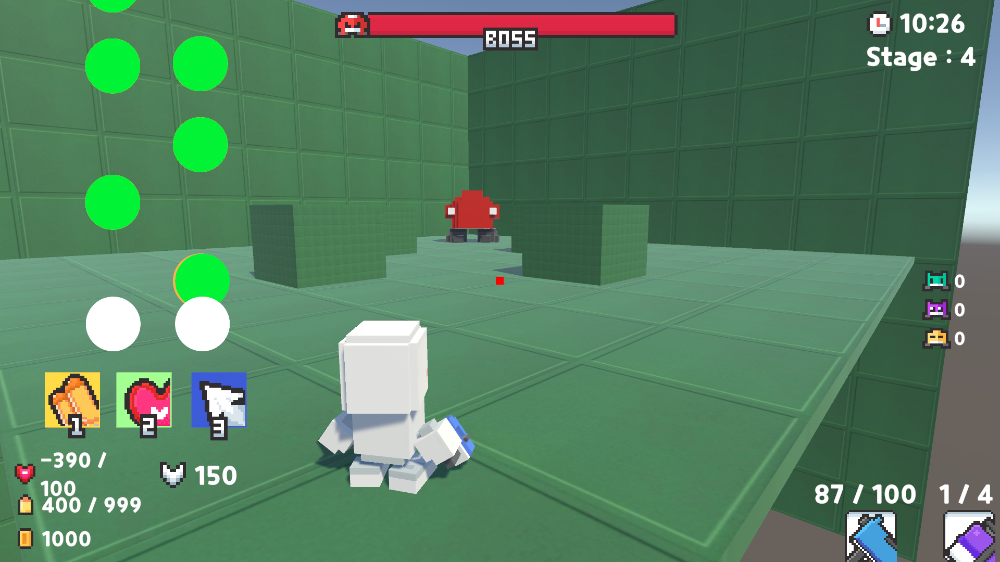

## Multiplayer complexity problem
Our initial plan was to make 4 players play on 4 different computers. However, while I was working on the multiplayer implementation, changing the variables of four players seemed too complicated. We had to sync the variables(health, score, ammo) for 4 different players, and the variables changes rapidly during the game. 

## How did we changed
Therefore, instead of dividing the rhythm player and combat player into two different computers, we decided to put them in one computer.

this is the brief demo screen for our new idea. The rhythm player will do the rhythm part using the keyboard "a" and "d" buttons, and changing the mode using "1", "2", and "3". For the combat player, we moved the controller from " wasd " to " pl;' ", so that two players can play on the same keyboard. This change makes the interaction between rhythm and combat players of the same team much easier. Their interaction does not have to update through the network, it can be done locally.

## Single Player
Since the network connection between 2players(same team of rhythm and combat players) is unnecessary, we came up with the idea of making a single player. (It is more likely a 2p co-op local player with a single computer)

### Overview
 - Co-op 2p vs AI
 - Two players will fight against monsters(AI)
 - Rhythm player's performance supports combat player
 - Final goal is to defeat the boss (Last stage)

### Rhythm Player
- Two-button input
- Each button plays its own beat map in sync with the other
- Hitting the notes gives different types of resources to the combat player 
-  * kind of resources they need (health, ammo, swag, money)

### Combat Player
- TPS 
- Weapons, ammo, health, etc are all obtainable only from the rhythm player
- Fight against the AI 

## Single Player - Stages
#### Stage 1

#### Stage 2

#### Stage 3

#### Stage 4

The brief goal of each stage is to defeat the boss before the song ends. The portal to the next stage will appear when the boss is down.
There are a total of 4 different monsters designed, the final stage boss is the most difficult, with 3 different types of attack patterns.

