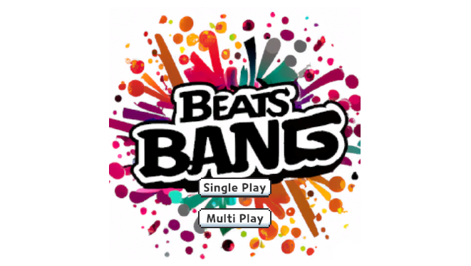
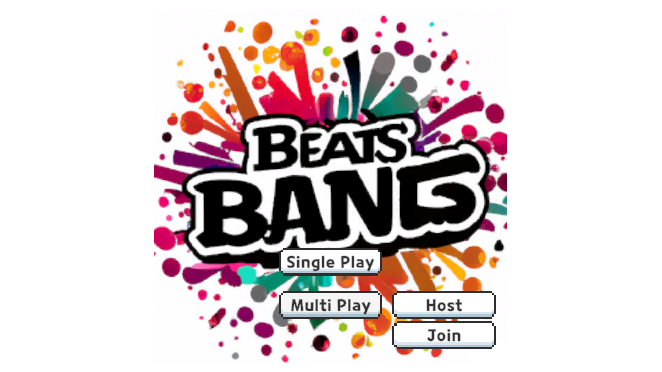
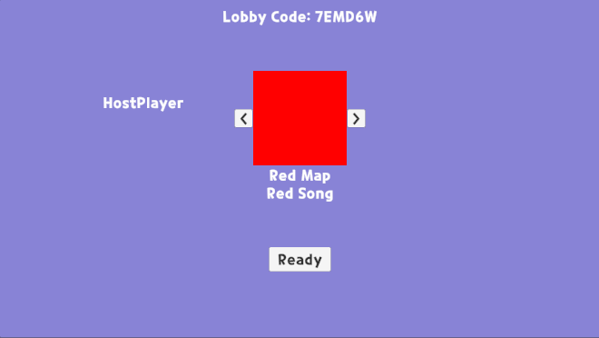
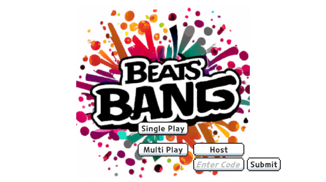
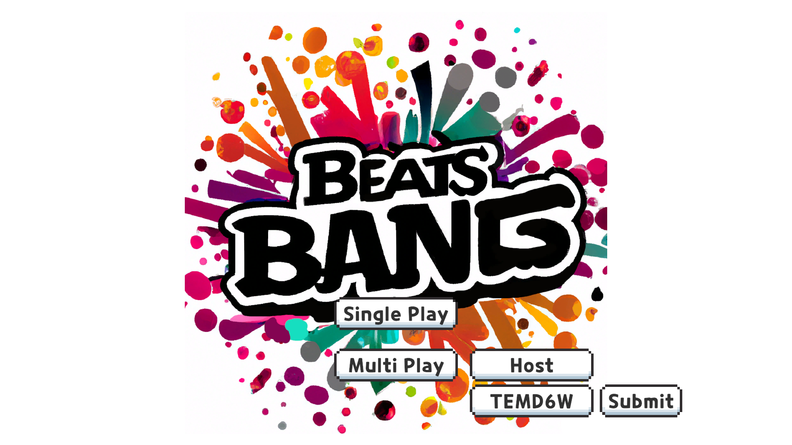
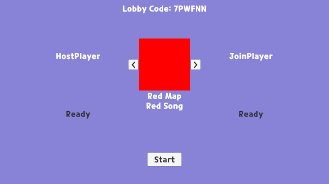
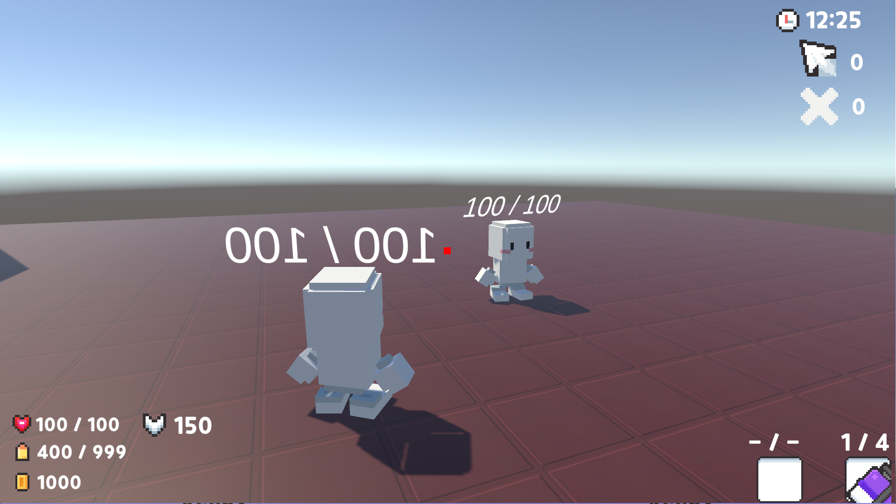
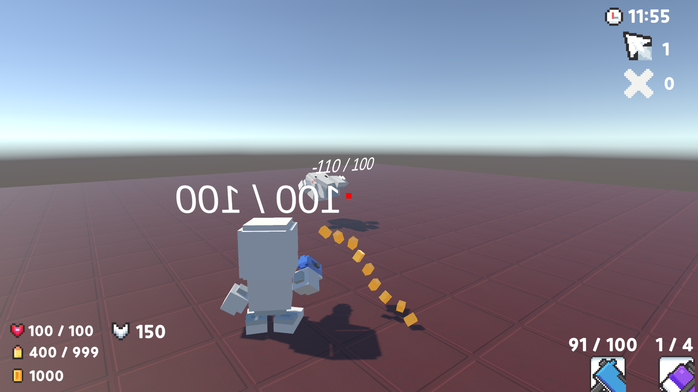

## Used Skills
- Netcode for GameObjects
- Unity Services
- * Lobby
- * Relay

## Multiplayer prototype
From the main screen, click the Multiplayer button

Then, Host and Join buttons will be shown.

Select Host to create a lobby. When entering the lobby, the room code will be shown, and the host is available to select the map(song).

When another player clicks the Join Button, an input for code will be shown.

Enter the same code from the host's lobby (this is a sample image and the code are not the same for the below image)

When both players are ready, the host can click the start button to start the game

Both players are in the game, their movement, animation, and variables are synchronized.

