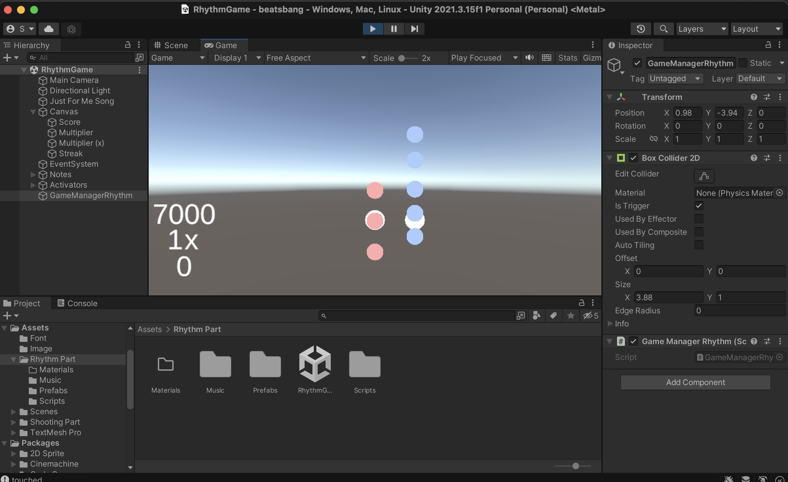

## Basic Structure
The rhythm portion of our game is structured not so differently from the layout of Guitar Hero. Rather than having four activators, we decided to run with two activators given the planned complexity of BeatsBang. The notes will conventionally fall from above. In the bottom left corner of the user interface the player will be able to see their score along with their streak and multiplier.
The current, general scoring system is as follows:
- hitting notes increases your score
- hitting consecutive notes increases your (missing a note or clicking prematurely resets this number)
- when you have achieved a certain streak value, your multiplier will increase
- the multiplier value determines how much the base value of a note is increased by

## Development Screenshot
Below is a screenshot of the basic structure of our rhythm game in development. 

The white circles are the two activators while the red and blue circles represent notes. The activators as stated in previous posts are binded to the A and D keys respectively.

## Next Steps: Beat Map
Now that basic fuctionality has been established for the rhythm game, the next step is producing a beat map. What this means in simpler terms is we must produce notes that fall in-sync with the chosen song. 

