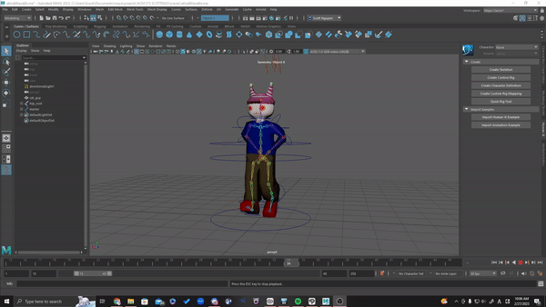

---
layout: post
title: Character Design, Prototype Model and 2d assets
subtitle: The pre-production to rigging process 
cover-img: /assets/img/scott/ezgif.com-video-to-gif.gif
thumbnail-img: 
share-img: 
tags: [Beats Bang, Rhythm]
--- 
## Character  and UI Designs

For our character design ideas, we wanted to go very vibrant and alive with the look of the game.  Starting with the playable character concepts, we wanted to try something with anthropomorphic animals, taking inspiration from older rhythm games like Dance Dance Revolution.  
IMAGE IMAGE
**2D concept illustrations of playable characters**  
From there, it was time to start working on making a playable character! Still new to modeling, so the model is still a bit away from to my liking. But with what I can do, I was able to model, texture and rig a prototype character for our game. 
  
  
**rigged prototype character and sample motion test**
 
 
Along with my 3d character model, I created 2d assets for our rhythm portion of the game. These have yet to be finalized and placed into our rhythm game, but this the general aspect of what the rhythm portion of the game is going to look like. 
IMAGE
