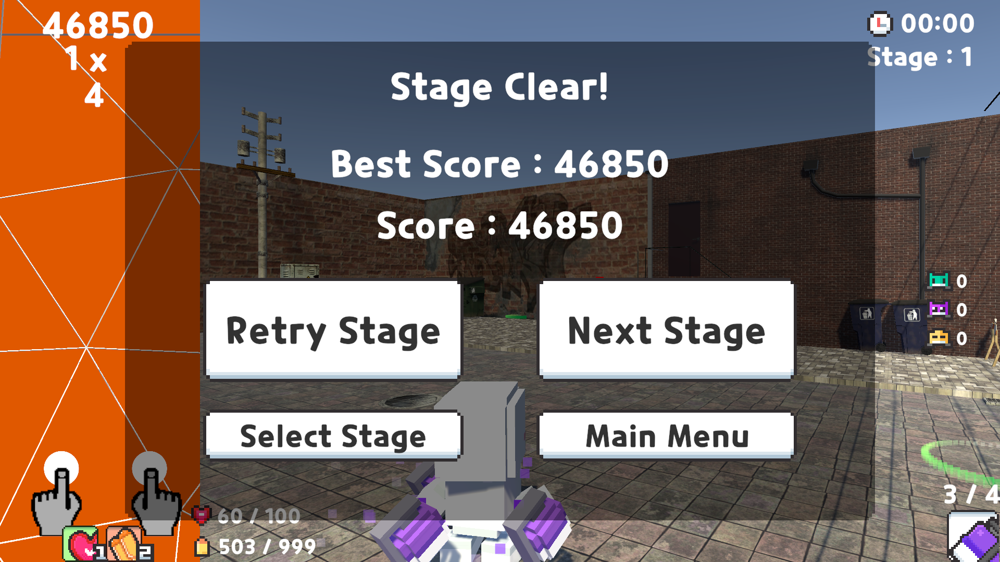

## Select Stage Scene

Instead of directly going into the game by clicking the SinglePlay button, we made a stage-select scene where each stage will be unlocked if the previous stage is cleared.

Also, the status(clear, high score) of each stage is available when the stage is clicked in the stage-select scene.

## In-game View

The rhythm and shooting player view is separated into two different screens instead of overlapping the rhythm player's screen on the shooting player's screen.   

There are UI of supplies(health/ammo) between the two player's screens so that both players can interact, and communicate with each other.

#### Game Over

When the player's HP hits 0, the result UI for the game over appears, and shows the score, the high score of that stage, and other buttons.

#### Stage Clear

When all enemies are eliminated and the song has ended, stage clear UI appears.
Stage Clear UI is similar to the game over UI, additional "Next Stage" button is included.

Return to the stage-select scene, it is possible to see the stage 2 is unlocked.

## In-game Options

When the "ESC" button is clicked, the option UI appears, the options are,

#### Sliders
- Background Volume
  - Adjust background music volume
- Sound Effect Volume
  - Adjust sound effect volume
- Mouse Sensitivity
  - Adjust mouse sensitivity

#### Buttons
- Sound Effect Test Button
  - Plays test sound for sound effect volume
- Retry Stage
  - Resets current stage and starts a new stage
- Stage Select
  - Return to stage-select scene
- Return Main
  - Return to main scene.

