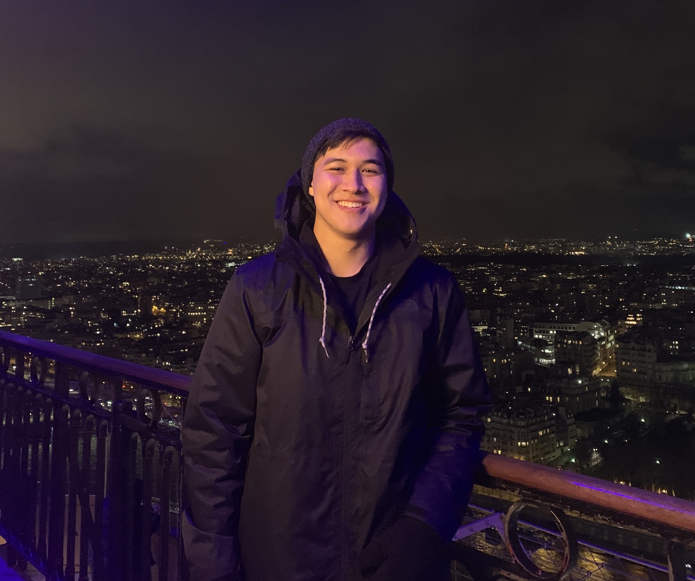

## Yong U Cho

|  |  |
|:--|:--|
||**Programmer, ICS Major**  I am a team member associated in developing game  "Beats Bang". My job was to develop the TPS shooting part of the game which included designing the enemy and stage selection menus  and linking the rhythm and shooting parts.

<i class="fa-solid fa-envelope"></i> <a href="mailto:yongu200@hawaii.edu">yongu200@hawaii.edu</a>  
<i class="fa-solid fa-file"></i> [github portfolio](https://yongu2000.github.io)

## Shane Severino

|  |  |
|:--|:--|
||**Programmer, ICS Major**  I am the next computer science student who worked on developing "Beats Bang".   I was responsible for the rhythm portion of our game which includes the mechanics, scoring, and contributing to the shared responsibility of producing beatmaps.   I also assisted with other software needs throughout the devlopment process like maintaining our website. |

<i class="fa-solid fa-envelope"></i> <a href="mailto:shanesev@hawaii.edu">shanesev@hawaii.edu</a>  
<i class="fa-solid fa-file"></i> [github portfolio](https://shane-sev.github.io)

## Scott Nguyen

|  |  |
|:--|:--|
||**Artist, Animator, ACM/SCA Major**  I am the team member responsible for the creative direction and visual aesthetics of the game. I'll be working on both 2D and 3D assets for the game, along curating the music and beatmaps involved in the rhythm portion of the game.

<i class="fa-solid fa-envelope"></i> <a href="mailto:scottngu@hawaii.edu">scottngu@hawaii.edu</a>  
<i class="fa-solid fa-file"></i> [github portfolio](https://scottnscoff.github.io) 
<i class="fa-solid fa-file"></i> [artist portfoliio](https://scottnscoff.wixsite.com/portfolio)
