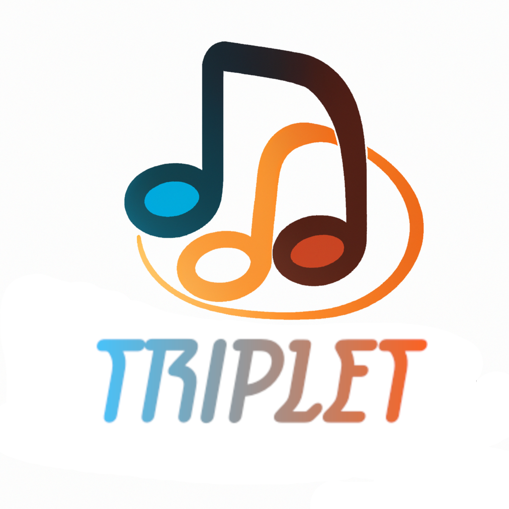

## Yong U Cho

|  |  |
|:--|:--|
||**Programmer, ICS Major**  I am a team member associated in developing game "Beats Bang"   My job was to develop the TPS shooting part of the game,  linking the rhythm part and shooting part using NetCode for  GameObjects, and building the Multiplayer Lobby and Server|

<i class="fa-solid fa-envelope"></i> <a href="mailto:yongu200@hawaii.edu">yongu200@hawaii.edu</a>  
<i class="fa-solid fa-file"></i> [github portfolio](https://yongu2000.github.io)

## Shane Severino

|  |  |
|:--|:--|
||**Programmer, ICS Major**  I am the next computer science student developing "Beats Bang".   I am primarily responsible for the rhythm portion of our game as well as   assist with any other software needs as they naturally arise during the development process. |

<i class="fa-solid fa-envelope"></i> <a href="mailto:shanesev@hawaii.edu">shanesev@hawaii.edu</a>  
<i class="fa-solid fa-file"></i> [github portfolio](https://shane-sev.github.io)

## Scott Nguyen

|  |  |
|:--|:--|
|png|**Artist, Animator, ACM/SCA Major**  I am the team member responsible for the creative direction and visual aesthetics of the game.

<i class="fa-solid fa-envelope"></i> <a href="mailto:scottngu@hawaii.edu">scottngu@hawaii.edu</a>  
<i class="fa-solid fa-file"></i> [github portfolio](https://scottnscoff.github.io) 
<i class="fa-solid fa-file"></i> [artist portfoliio](https://scottnscoff.wixsite.com/portfolio)
