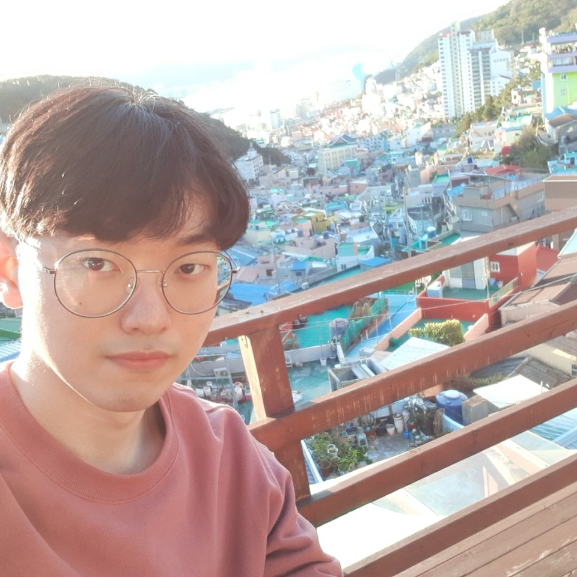
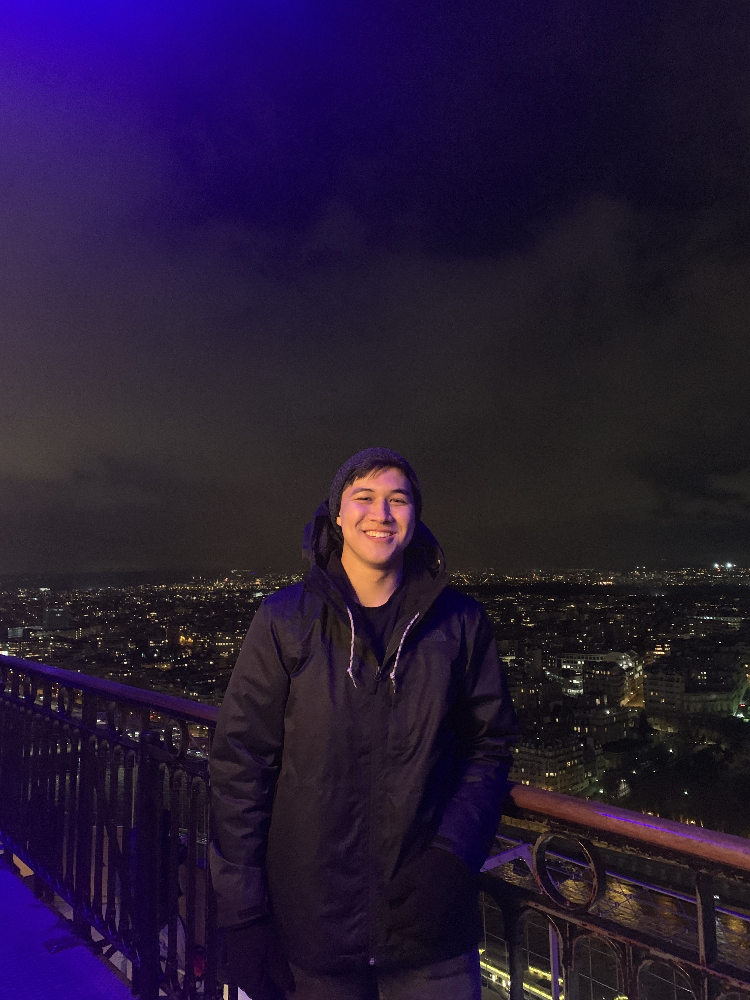

## Yong U Cho

|  |  |
|:--|:--|
||**Programmer, ICS Major**  I am a team member associated in developing game "Beats Bang"   My job was to develop the TPS shooting part of the game  including the enemy and stage selections, and   to link the rhythm and shooting parts

<i class="fa-solid fa-envelope"></i> <a href="mailto:yongu200@hawaii.edu">yongu200@hawaii.edu</a>  
<i class="fa-solid fa-file"></i> [github portfolio](https://yongu2000.github.io)

## Shane Severino

|  |  |
|:--|:--|
||**Programmer, ICS Major**  I am the next computer science student developing "Beats Bang".   I am responsible for the rhythm portion of our game as well as assisting   with any other software needs as they naturally arise during the development process. |

<i class="fa-solid fa-envelope"></i> <a href="mailto:shanesev@hawaii.edu">shanesev@hawaii.edu</a>  
<i class="fa-solid fa-file"></i> [github portfolio](https://shane-sev.github.io)

## Scott Nguyen

|  |  |
|:--|:--|
||**Artist, Animator, ACM/SCA Major**  I am the team member responsible for the creative direction and visual aesthetics of the game. I'll be working on both 2D and 3D assets for the game, along curating the music and beatmaps involved in the rhythm portion of the game.

<i class="fa-solid fa-envelope"></i> <a href="mailto:scottngu@hawaii.edu">scottngu@hawaii.edu</a>  
<i class="fa-solid fa-file"></i> [github portfolio](https://scottnscoff.github.io) 
<i class="fa-solid fa-file"></i> [artist portfoliio](https://scottnscoff.wixsite.com/portfolio)
