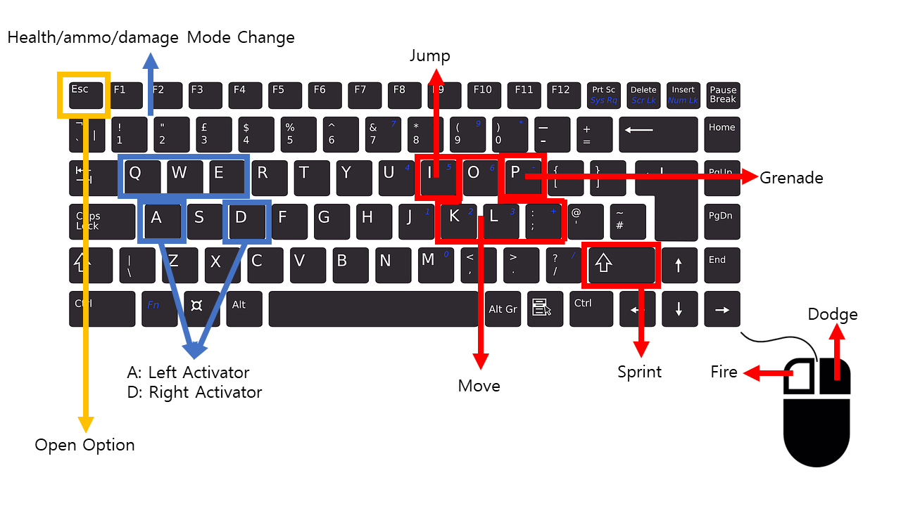

## Introduction
Save the world from extraterrestrial, music note aliens with the power of rhythm and teamwork in Beats Bang! Beats Bang is a two player game combining elements from traditional rhythm games and third person shooters on one computer. One player will be in charge of the rhythm game and is responsible for supporting the shooter as he works to defeat all of the aliens! 

## Download
[Windows](https://drive.google.com/file/d/1aHPHHQnGQ-lkobXxp5XztXxD8QSbJTG9/view?usp=sharing)
[Mac]

## How-to-play

#### Keyboard Controls

#### Rhythm Player (Blue)
Each correct note hit by the rhythm player will be converted to resources for the combat player. The rhythm player is able to switch between three different modes (health/ammo/strength) to provide their teammate with the desired resource.

#### Combat Player (Red)
Eliminate all enemies with the supplies given from the rhythm player.

## Host/Join 
intro about multiplayer (under development)
